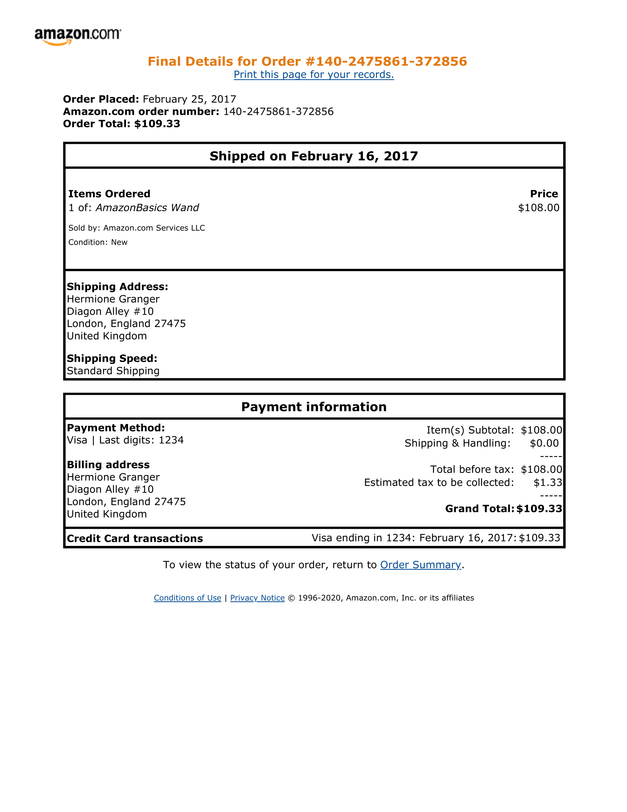
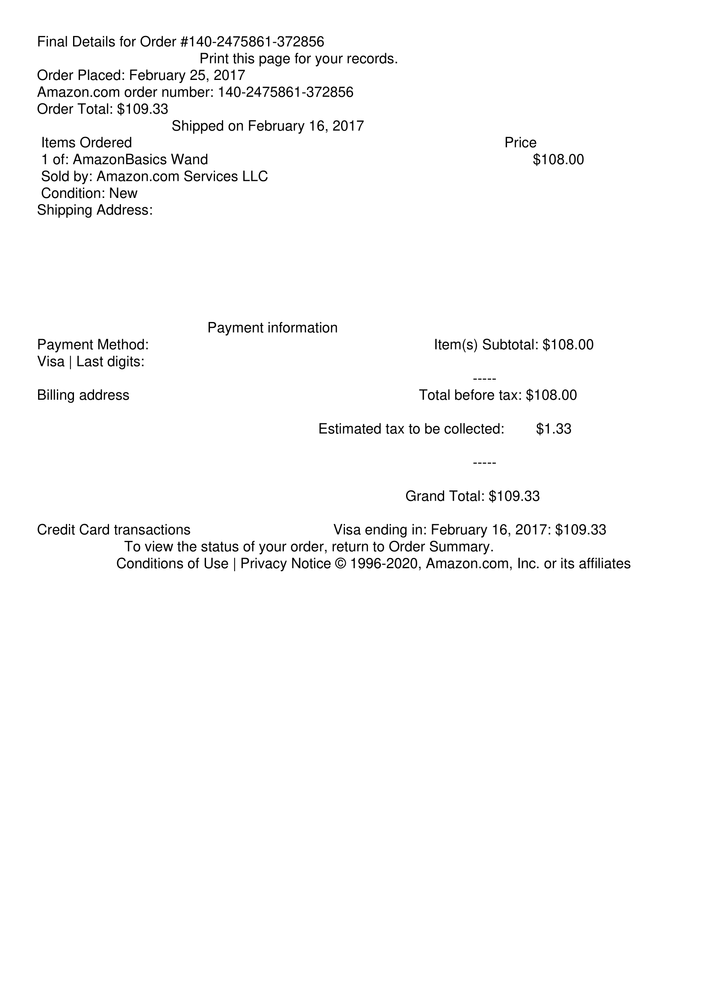
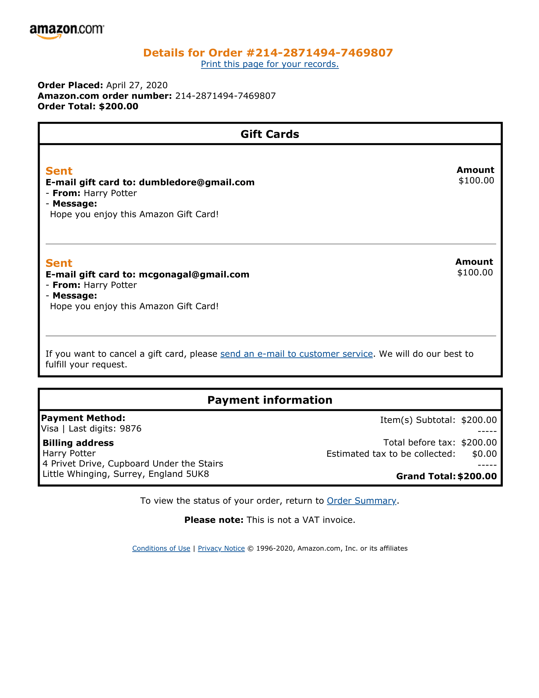
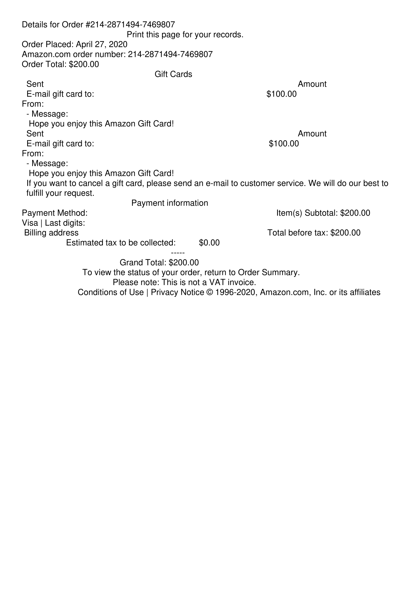
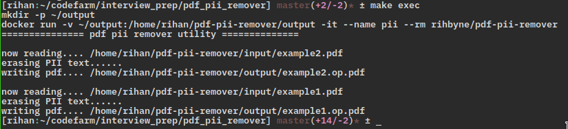

# PDF PII Remover
a python utility that removes Personally Identifiable Information(PII) from given PDF documents in `input` directory and saves the revised documents in `output` directory.

Here is given example PDF document `example1.pdf` residing in `input` directory. 


Running the pii utility erases PII relevant information from `example1.pdf`


Similary, for the given second document `example2.pdf`


The utility erases PII relevant information from `example2.pdf`


## Running the PII utility as a Docker container
The simplest one stop command to run the utility and process the PDF documents, assuming you are running a suitable linux distribution.
 ```console
 docker run -v ~/output:/home/rihan/pdf-pii-remover/output -it --name pii --rm rihbyne/pdf-pii-remover
 ```
 The above command will pull the docker image from public docker hub onto your local computer, followed by mount a volume(option `-v)` in `~/output` in your home directory to persist modified documents after program is terminated because, as we all know, containers are ephemeral. The `-rm` flag is used to immediately remove the container once it is exited. `--name` flag refers to suitable name given to the running container which is local to only your host.

You should get the following output:

